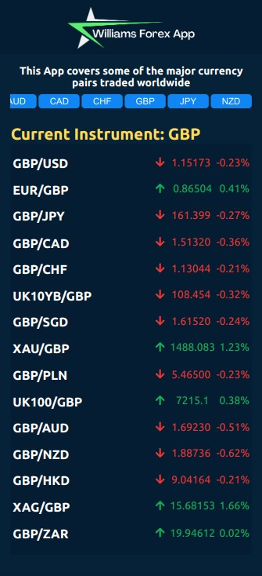

# Space Traveler's Hub

> This is a Web APP Focused only on currency trading, covers some of the major currency pairs traded worldwide, such as EUR/USD, USD/JPY and GBP/USD. The users are able to view live prices for the major Forex pairs, and to learn what factors that impact their price movements.

This project was bootstrapped with [Create React App](https://github.com/facebook/create-react-app).

> Presentation Video [Link](https://www.loom.com/share/5699c3002f464c01a21b434e73408307)

## Built With

- Visual Studio Code, Git, GitHub using Gitflow.
- React components.
- Redux toolkit.
- Modular CSS.
- Jest.

## Quick view
> 
> 

## Live Demo

[Press here to see this project live](https://spacetravelerswilliamscch.netlify.app/)

## Getting Started

### Prerequisites
- To get a local copy up and running, copy the SSH key of the repository and run `git clone` in your terminal.

### Install
- `npm install`: Install all the dependencies required locally.

### Setup
- `npm run build`: Builds the app for production to the `build` folder.\
It correctly bundles React in production mode and optimizes the build for the best performance.

The build is minified and the filenames include the hashes.\
Your app is ready to be deployed!

### Deployment
- `npm start`: Runs the app in the development mode.
Open [http://localhost:3000](http://localhost:3000) to view it in your browser.

The page will reload when you make changes.\
You may also see any lint errors in the console.

### Run tests 
- `npm test`: Launches the test runner in the interactive watch mode.\

## 👤 Author

👤 **Williams Colmenares**
- GitHub: [@williamscch](https://github.com/williamscch)
- Twitter: [@wdavidcch](https://twitter.com/wdavidcch)
- LinkedIn: [LinkedIn](https://www.linkedin.com/in/williamscolmenaresch/)

## 🤝 Contributing

Contributions, issues, and feature requests are welcome!

Feel free to check the [issues page](../../issues/).

## Show your support

Give a ⭐️ if you like this project!

## Acknowledgments

- Microverse Module 3 React and Redux Capstone Project.
- Project indications [here](https://github.com/microverseinc/curriculum-react-redux/blob/main/capstone/react_capstone.md).
- Data Provided by Financial Modeling Prep [Link API](https://financialmodelingprep.com/developer/docs/).

## 📝 License

This project is [MIT](./MIT.md) licensed.
